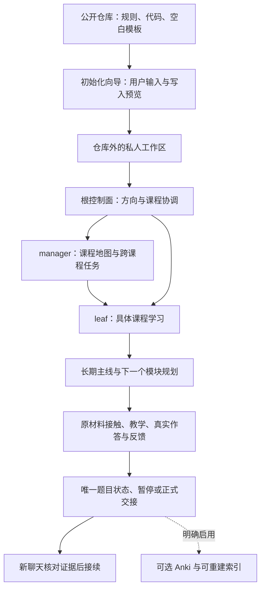

# 系统架构与实现 / Architecture and implementation

## 中文

Learning OS 的核心是一个由本地文件保存上下文、由用户自己的 agent 执行的学习工作区。Python 控制面帮助定位、取得规则与检查结构；教学、材料核对和学习判断仍需 agent 与用户共同完成。它不运行独立模型服务，不在后台监控用户。



公开仓库与私人工作区是独立目录。初始化复制通用运行时和规则，生成用户自己的画像和课程；没有连接作者原系统的共享数据或反向同步。升级公开仓库也不会更新既有私人工作区，后续更新需在测试目录验证并由用户检查差异。

### 各部分如何实现

| 部分 | 文件与机制 | 当前候选状态 |
| --- | --- | --- |
| 安装与画像 | [初始化器](../tools/init_workspace.py)验证输入、默认预览、显式创建；画像可未知，教材仅引用 | 代码测试通过 |
| agent 入口 | 公共AGENTS、CLAUDE；私人根和各节点分别生成入口；CLAUDE导入AGENTS，叶节点显式读取根规则 | 文件链路已生成，实际双客户端行为待测试 |
| 根控制面 | [运行时](../templates/system/learning.py)的brief、status、overview、guidance-context | 独立临时工作区命令已验证 |
| 节点结构 | 显式node_type、父manager；分类目录不是学习节点；new预览、apply创建、拒绝覆盖 | 初始化与新增节点测试通过 |
| 任务路由 | [唯一规则索引](../templates/system/规则索引.md)中的人机共用路由表，open/plan-context按场景读规则 | 路由及本地链接测试通过 |
| 学习方法 | [学习循环与偏好](../templates/system/学习偏好.md)、视频流程；作者方法是建议，具体节奏由新用户决定 | 通用规则已抽取 |
| 主线与规划 | [短期规划](../templates/system/短期规划协议.md)、模块模板；先核材料、前置和全部归属原题，再定下一个模块 | 协议已抽取；完整实际学习流程未验证 |
| 材料 | [PDF读取协议](../templates/system/教材读取协议.md)与[只读工具](../tools/read_study_material.py)，页标记、原图定位、同页修订；专用题组解析有明确适用范围 | 虚构材料的按页读取测试通过，真实PDF视觉行为未测试 |
| 作答 | [教材题目协议](../templates/system/教材题目执行协议.md)按证据、处置、下一步三列保留事实；唯一清单，不产生掌握分数 | 协议已保留，不宣称所有agent执行可靠 |
| 停止与接续 | [模块切换](../templates/system/模块切换协议.md)：partial恢复未完任务；completed表示范围已处理，不表示掌握；正式交接保存回读后新聊天接续 | 原Starter有一次接续观察；完整新系统待端到端验证 |
| 临时书签 | checkpoint显式调用，版本检查、排他锁、原子替换、回读；无会话采集或周期hook | 冲突保留新位置测试通过 |
| 可选扩展 | [Anki候选与预览/导入/回读](../templates/system/Anki制卡与导入协议.md)；[SQLite元数据索引](../templates/system/本地索引说明.md)，不替代Markdown | Anki假API与索引代码测试通过；未连接真实Anki |

代码中的证据入口数只表示可定位的交接或作答记录。agent必须读正文核对真实性，不能由元数据、文件日期或条数推断掌握。索引与导出同样不增加学习事实。

### 生成工作区的控制面命令

在自己的私人工作区运行，通常由agent代为调用：

```sh
python3 learning.py brief
python3 learning.py overview 科学
python3 learning.py open 科学/入门
python3 learning.py plan-context 科学/入门
python3 learning.py doctor
python3 learning.py new 进阶 --parent 科学 --role leaf
# 确认新增清单后，上一条命令加 --apply
```

节点名替换成自己的实际路径。open只提供规则与主页，下一步仍须读主页指定的当前模块、唯一题目清单和最近交接；不能按最大模块编号猜进度。doctor仅验证结构与链接。

checkpoint先inspect取得版本，再带expected保存短位置；旧版本冲突时保留现有文件。遗留锁导致失败时先检查是否仍有写入操作，不自动删锁或强制覆盖。

## English

Learning OS is a local learning workspace whose durable context lives in files. Your own agent performs teaching and record keeping with you. The Python control plane routes courses, reads scoped rules and checks structure; it does not host a model or monitor you in the background.

The diagram shows the complete architecture. Public code and protocols are copied into a separate private workspace during initialization. Your profile, material references, courses, answers and handoffs stay there. There is no shared mutable state or synchronization with the author's private system. Updating the public checkout does not update an existing private workspace.

The root coordinates goals and courses. Managers maintain maps and authorized cross-course tasks. Leaves contain course-specific learning. A classification folder is not a node. A leaf cannot contain another course. The initializer and node creator preview their writes and refuse existing targets.

The human-readable rule index is also the runtime routing manifest. `open` obtains course instructions; `plan-context` obtains planning rules and entry points. Neither replaces reading the actual module, exercise checklist, materials or handoff. Course discovery uses explicit node files rather than the largest module number.

Planning follows the user's long-term goal, actual material structure, prerequisites and complete assigned exercise groups. Teaching preserves a distinction between independent answers, hints, demonstrations and unanswered work. Each exercise has one status location with evidence, disposition and next action. A plan or a profile never proves mastery.

PDF text and OCR help locate content; required visual checks still involve opening the original page image. The read-only tool handles explicit page-aligned materials and exposes correction records without accepting them as truth. Its Wangdao section parser is a specialized adapter, not a universal book parser.

Partial handoffs resume unfinished work. Completed handoffs mean the assigned scope was handled, not that everything was mastered. At the boundary, save and read back the handoff, then start a new chat by default. Optional checkpoints use revision checks, an exclusive lock and atomic replacement; they do not collect chats or enable hooks.

The control-plane commands shown above run in the generated private workspace. Structure, initialization, read-only routing, checkpoints and the rebuildable metadata index have code-level tests. The optional Anki adapter defaults to preview, requires an enabled local configuration and explicit `--apply`, and verifies imported notes through readback. It has offline fake-API tests; no real Anki import has been performed. A [fictional complete file workflow](../examples/full-cycle/README.md) is reproducible, while actual Codex/Claude learning behavior and external trials remain unverified. File and metadata checks cannot establish learning outcomes or model reliability.
